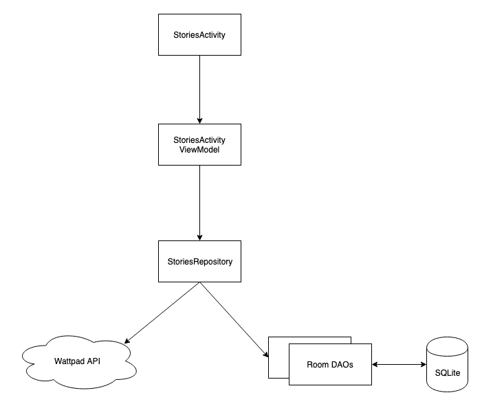

## Stories

A simple android app that displays the best stories from Wattpad.

### Architecture

The app is built on Kotlin and follows a MVVM architecture. The android activities function as views, the 
viewmodel serves the business logic and holds properties in the form of **LiveData** which the activity
observes.

The viewmodel works with the **repository** which abstracts out the data source from the viewmodel. The 
two data sources that we have in the app are the Wattpad API and a SQLite database.

Viewmodels in the app extend the **android architecture components** ViewModel classes. 
The caching to provide offline functionality wa achieved using a SQLite database which was built using
the **Room persistence library** from Google.

**Dependency Injection** was achieved using Koin.

### Testing efforts
- The viewmodel and the repository have been unit tested.
- Instrumentation testing was used to test the views (activities).The UI tests run best on an emulator. 
Due to a dependency on one of the UI testing library, the tests need to be run on a stock android
emulator with **no** Google Play services or Google APIs

### Other Libraries used on the project
* Android architecture components (ViewModel, LiveData and Room)
* RxJava and RxAndroid ( Reactive programming and multi threading)
* Koin (Dependency Injection)
* Glide (Image loading, rendering and caching)
* Timber (Logging)
* GSON (JSON parsing)
* Test Butler
* Mockito (Unit testing)
* Espresso (Automation/UI testing)

P.S: Screenshots can be found in the screenshots folder.
